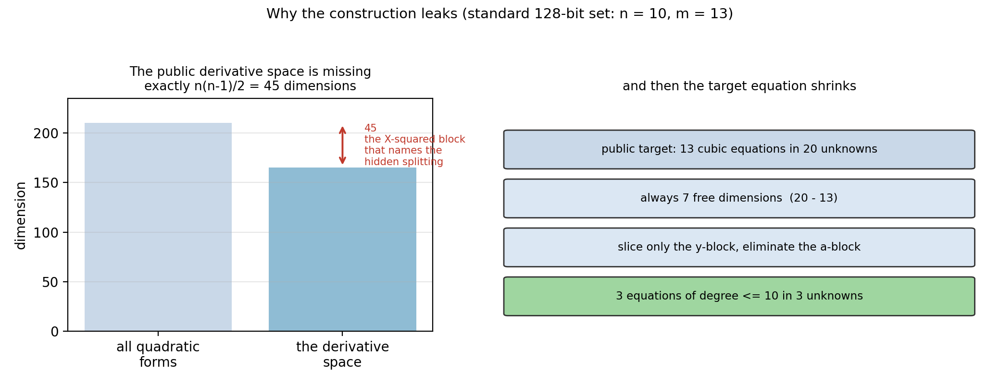

# Facto-DSA reproduction: a signature forged from the public key alone

> At the standard 128-bit parameters (`q = 65519`, `n = 10`, `m = 13`) the
> public key alone yields an equivalent internal description of the scheme and
> a 40-byte signature that the submitter's **own `sig_verify` accepts**.  No
> secret key and no signing oracle is used anywhere.

One page of plain language, no algebra: [EXPLAINED.md](EXPLAINED.md).
Publication record and site material: [docs/finding.md](docs/finding.md).
Interactive walkthrough of a real run: `demo/attack-128.html`, built by
`scripts/make_attack_demo.py`.
Forge signatures for your own messages: `scripts/forge_server.py`.

## The attack, in plain terms

```
  public key P (only public data)
      |
      | 1. all 210 first derivatives together span only 165 dimensions.
      |    The 45 missing ones name the hidden split of the variables.
      |                                            -- linear algebra, 0.06 s
      v
  P(x, y) = (quadratic in x) * y  +  (cubic in y)
      |
      | 2. that quadratic part *is* the triangular map, up to a change of
      |    basis, and triangularity is a property of the space it spans.
      |    Recover a triangular flag by peeling rank-one points.
      |                                            -- msolve, 13 s
      v
  P(z) = h   becomes   f = m - n = 3  equations of degree <= 10 in 3 unknowns
      |
      | 3. slice only the y-block and eliminate the a-block, then read
      |    msolve's rational parametrisation of what is left.
      |                                            -- msolve, 0.40 s
      v
  preimage z  ->  encode as 40 bytes  ->  the authors' sig_verify returns 0
```

The whole point is that step 1 is *free*: it is a dimension count on the public
key, not a search.  Everything after it is small.  Why the construction forces
this - and what would have to change to remove it - is in
[docs/route.md](docs/route.md).



## How this differs from the earlier work

### Against the earlier working folders (`code/factodsa_*`)

The exploration happened in six separate folders: `factodsa_cubic_structure`
(structure extraction, explicitly "no signing, target inversion, original-key
reconstruction, or Hankel completion"), `factodsa_flag_recovery` (the
triangular flag at `n = 2, 3`), `factodsa_forge` (the chain down to
`P(z) = h`, demonstrated at `n = 2..6`), `factodsa_functional_check` (the patch
that adds a functional harness to the submitter's tree),
`factodsa_independent_checks` and `factodsa_target_system` (exporting the public
`P(z) = h` system for msolve/Sage/Singular).  This folder is the consolidated,
runnable version of that work, and it closes the three gaps those folders
recorded:

| | earlier folders | this folder |
|---|---|---|
| standard 128-bit set (`n = 10`) | **not completed**: the target was solved with msolve on the raw 13-quadratic-in-13-variables bilinear system, which is Macaulay-bound and stalled past 240 s | **forged in 13.8 s**: slice only the `y`-block, leaving 3 equations of degree <= 10 in 3 unknowns, and read msolve's parametrisation |
| verification level | `P(z) = h` checked in our own code | the **authors' `sig_verify`** accepts, on a vendored KAT public key, with a flipped-bit negative control |
| packaging | six folders, each with its own runners and study scripts | one package (`src/`), one set of entry points (`scripts/`), `make` targets, recorded results in `results/`, figures in `figures/` |
| parameter analysis | not recorded in those folders | `f = m - n` decides reachability; the submitter's criteria admit `f = 1` sets at 160/192/256 bits |
| independent check | — | `make sage-check`: a second toolchain re-checks the forgery and the structural claims |

The structural recovery is the same route as in those folders.  What changed is
the inversion stage (slicing only the `y`-block and reading msolve's
parametrisation, instead of handing the raw 13-variable bilinear system to
msolve), the scale the chain now reaches, and what it is checked against.

### Against the public reproduction harness (`ngcc-harness`, `sign-10-1`)

The public harness records one entry for Facto-DSA, `sign-10-1`, status `Lead`,
verification `review`, and its bundled cryptanalysis stops at an equivalent
triangular central map because a universal forger would first need the
Hankel-container (GRS) identification.  This route never needs it:

| | `ngcc-harness` `sign-10-1` | this folder |
|---|---|---|
| scale | `n = 5, 6` | **`n = 10`, the standard 128-bit set** |
| structure | K2 from a restricted XL system | derivative space + trace-annihilator, every public coefficient rebuilt as a certificate |
| after the flag | blocked on the Hankel container | not needed: the target equation is solved directly |
| forgery | not reached | reached, and **accepted by the authors' code** |
| parameter insight | none recorded | `f = m - n` decides reachability |

Reproducing both sides is described in [docs/positioning.md](docs/positioning.md).

## How it is tested

| tool | used for |
|---|---|
| **Python >= 3.10 + NumPy** | the attack itself; no Sage import anywhere in the attack path |
| **FLINT 3.x** through `src/factodsa/finite_field.c` | exact linear algebra over `F_q` (rank, kernel, rref, solve, determinant, product); built by `scripts/build_backend.sh`, loaded with `ctypes` |
| **msolve 0.10.1** | rank-one point finding, and the reduced system: its rational parametrisation is a univariate representation and is read directly (`solve_method: parametrization`) |
| **a C compiler** (`cc`) | builds the FLINT backend and the acceptance helper, which `#include`s the authors' vendored `SIG_AlgorithmInstance.c` so the protocol hash and `sig_verify` are the authors' own |
| **SageMath** (optional) | only `make sage-check`: an independent re-check with Sage polynomial and matrix objects, sharing no code with the attack |
| **matplotlib** (optional) | `scripts/visualize.py` |

Correctness is never "it printed forged": every candidate is checked against
**every** public cubic coefficient of `P(z) = h`, the structural recovery
rebuilds every public coefficient as a certificate, and the end-to-end claim is
decided by the submitter's own verification routine.

## How this was built, and where it came from

The implementation in this repository, the runners, the figures and these
documents were produced with **DeepSeek Flash**, an agentic coding model: it
wrote and refactored the code, ran the benchmarks on the machine described
below, tracked down the platform issues (the FLINT build, the stale backend,
the PYTHONPATH trap in the acceptance command) and drafted the documentation.

The work grew out of the same working environment, which already held an
analysis of a **previous version of Facto-DSA** and a set of implementation
sketches - the `code/factodsa_*` folders described above.  That earlier material
is what pointed at the attack angle taken here; it is kept unchanged next to
this folder, and this repository is the consolidated version of it.  Parts of
the mathematical route were shaped by ideas that came up in discussion with
**GPT-6 Astra**.

A note on provenance, to keep two things apart.  The attack on **projected**
Facto-DSA and its proof are the material of the M1 report (*Cryptanalysis of
Factorization-Based Multivariate Signatures*): that work was done **without AI**,
and the report is the place to read the intuition behind the projected attack.
Projected Facto-DSA is a different scheme variant from the cubic submission
attacked here, so the report does not describe this repository.

This repository is the separate implementation for the standard 128-bit set of
the cubic submission.  What the assistants listed above contributed is that
implementation, its benchmarks and its documentation.

One caveat from the author: these tools help spot patterns, find witnesses and
get small-scale implementations running quickly, but some of the mathematics
still needs manual checking, the attack angles they suggest can be hard to
follow and are not always well motivated, and there are parts of the attack
implemented here that I do not fully understand myself yet.

Every number here is a recorded run of the scripts in `scripts/`, re-executed
after each change, and every claim is decided by an exact certificate or by the
submitter's own verification code - not by the assistant.  This is unofficial
work, not connected to the submitters of Facto-DSA beyond the public materials
vendored here.

## Results

Standard 128-bit instance, `q = 65519`, `n = 10`, `m = 13`
([`results/standard-128-seed0.json`](results/standard-128-seed0.json)):

| stage | seconds |
|---|---|
| structural recovery | 0.06 |
| triangular flag (rank-one peeling, msolve) | 13.3 (the stage is randomised: 4-76 s over runs) |
| reduced solve (msolve parametrisation) | 0.40 |
| **total** | **13.8** (peak 67 MiB) |

Acceptance against the authors' implementation
([`results/acceptance/acceptance.json`](results/acceptance/acceptance.json)),
using the vendored KAT public key:

| check | value |
|---|---|
| public key bytes | 40040 |
| forged signature bytes | 40 |
| `sig_verify` return code | **0 (accept)** |
| one flipped signature bit | -1 (reject) |

Small-parameter regression ([`results/small-validation.json`](results/small-validation.json)):
3/3 forgeries at each of `n = 2,3,4,5,6` with `m = 2n-1`, i.e. **15/15**, with
per-instance medians of 0.07, 0.10, 0.20, 0.44 and 1.32 s; the whole suite runs
in about six seconds.

Higher-target `f = 1` set ([`results/higher-targets.json`](results/higher-targets.json)),
`n = 14`, `m = 15` (a 160-bit target under the submitter's criteria):

| stage | seconds |
|---|---|
| structural recovery | 0.17 (peak 97 MiB) |
| triangular flag | 114 |
| reduced solve (one univariate polynomial of degree <= 14) | 0.02 |

3/3 candidate preimages valid.  `n = 17` and `n = 22` (the 192- and 256-bit
`f = 1` sets) have not been driven end to end here; the flag stage is the
binding one.

## Expected cost

Let `f = m - n`, the number of unknowns left after slicing only the `y`-block,
and let `D <= n^f` be the degree of the reduced ideal.

| stage | cost | measured |
|---|---|---|
| structural recovery | `O(n^7)` field operations, `O(n^5)` memory (dense bound) | `n=10`: 0.06 s / ~50 MiB; `n=14`: 0.17 s / ~100 MiB; `n=17`: 0.57 s / ~155 MiB; `n=32`: ~19 s / ~1.4 GiB |
| triangular flag | worst case `Theta(2^n)` from the backtracking; each level solves a `k(k-1)/2`-equation rank-one system | `n=10`: 4-76 s; `n=14`: 114 s |
| reduced solve | F4 plus a parametrisation on a system of degree `D <= n^f`; our side is `O(D)` per root | `f=1`: 0.02 s; `f=3`: 0.40 s |
| image condition and rescaling | a few scalar multiplications per candidate | included above |
| acceptance | encode `2n` `uint16` and call the authors' verifier | milliseconds |

**`f = m - n` is what decides reachability**, and the submitter's parameter
criteria never mention it:

| set | n | m | f | Bezout of the reduced system | status |
|---|---|---|---|---|---|
| official 128 | 10 | 13 | 3 | `10^3` | **forged** |
| official 256 | 17 | 32 | 15 | `17^15 ~ 2^61` | out of reach |
| official 512 | 32 | 62 | 30 | `32^30 ~ 2^150` | out of reach |
| 160-bit target, `f = 1` | 14 | 15 | 1 | `14` | **forged** |
| 192-bit target, `f = 1` | 17 | 18 | 1 | `17` | flag stage pending |
| 256-bit target, `f = 1` | 22 | 23 | 1 | `22` | not tested |

So the official 256- and 512-bit sets are **not** broken, for a reason no
hardware changes: after the reduction they are systems in 15 and 30 unknowns.
The same parameter filter admits `f = 1` sets at 160, 192 and 256 bits, where
the entire inversion stage degenerates to the roots of a single univariate
polynomial of degree `<= n`, and the flag recovery becomes the binding stage.
That is the design lesson of this work, and it is plotted in
`figures/bezout-vs-f.png`.

## Known gaps

The full list is in [docs/limitations.md](docs/limitations.md).  In short:

* **Only the standard 128-bit set is broken.**  The official 256- and 512-bit
  sets have `f = 15` and `30`, which puts the reduced system out of reach of
  this route (`2^61` and `2^150`).  That is a property of the parameter choice,
  not of the hardware.
* **Of the `f = 1` sets, only `n = 14` (160-bit target) is driven end to end.**
  `n = 17` and `n = 22` are untested; there the flag recovery is the binding
  stage.
* **The flag recovery has no complexity bound.**  It is correct by certificate,
  but its worst case is exponential in `n` (`Theta(2^n)`) and it is the slowest
  stage: 4-76 s at `n = 10`, 114 s at `n = 14`.  It is also randomised, so
  single-run timings vary.
* **The recovered object is an equivalent trapdoor**, not the submitters'
  secret basis.
* **The inversion needs msolve to separate with one variable.**  That is what
  msolve did on every instance measured here.  There is no second solver, so a
  slice that msolve answers in another chart is reported as unsolved instead of
  being salvaged.
* **Verification is at the level of the vendored materials**: the authors' own
  `sig_verify` from the 128-bit reference tree, on the 128-bit KAT public key.
  The 256-bit KAT keys ship no reachable instance for this route.
* **The image condition is met probabilistically**, by the signer's own
  rescaling; a few scalings per sampled solution are tried.  Reported timings
  include that retrying.

## Quick start

```sh
python3 scripts/check_environment.py            # must print READY first
python3 scripts/run_small_validation.py         # fast regression: 15/15
python3 scripts/run_standard_128.py             # the standard 128-bit instance
python3 scripts/run_acceptance.py --source kat  # authors' sig_verify returns 0
python3 scripts/run_higher_targets.py --sets 160
python3 scripts/measure_structure_scaling.py   # the n = 10/14/17/32 cost table
python3 scripts/visualize.py                    # figures/
python3 scripts/make_attack_demo.py             # demo/attack-128.html
sage -python scripts/verify_with_sage.py        # optional: independent re-check
```

`python3 scripts/forge_server.py` (`make forge`) starts a local page where you
type a message - or paste a raw target - and get as many signed preimages as you
ask for.  The target-independent part of the attack (12 s) runs once at
start-up; every request after that is about 0.5 s, and each candidate is checked
with the submitters' own `sig_verify`.  Runs on `127.0.0.1` only.

`make check`, `make small`, `make standard`, `make acceptance`, `make scaling`,
`make figures`, `make demo`, `make forge` and `make sage-check` run the same
commands.

Requirements: Python >= 3.10 with NumPy, a C compiler, FLINT (headers and
library) and `msolve` >= 0.10 on `PATH`.  matplotlib and SageMath are optional.
`scripts/check_environment.py` verifies all of it and builds the FLINT backend
if it is missing.  Everything runs as `python3 scripts/...` with no PYTHONPATH
to set.  macOS and Linux are supported; `scripts/build_backend.sh` finds FLINT
through `FACTO_FLINT_PREFIX`, `pkg-config`, Homebrew, the active conda prefix,
`/usr` or `/usr/local`, and stops with a clear message on any other platform.

## Layout

| path | contents |
|---|---|
| `vendor/spec/` | the submitter's algorithm specification (PDF) |
| `vendor/reference-128/` | the submitter's reference implementation, unmodified |
| `vendor/kat/` | the submitter's KAT test vectors for the 128-bit set |
| `patches/` | our patch adding a functional harness to the submitter's tree |
| `src/factodsa/` | the attack: recovery, flag, solve, inversion, acceptance |
| `scripts/` | environment check, runners, the interactive forger, Sage re-check, figures |
| `docs/` | route, stage-by-stage chain, complexity, acceptance, positioning, limits |
| `results/` | recorded outputs of the runs quoted above |
| `figures/` | generated diagrams and plots |
| `demo/` | the interactive walkthrough, a single self-contained HTML file |

Everything here is research code for a *submitted* algorithm; see `NOTICE.md`
for provenance and intended use, and `docs/limitations.md` for the exact scope
of the claims (equivalent trapdoor, not the original secret basis; official
256- and 512-bit sets not broken; flag recovery certified but not provably
polynomial).
